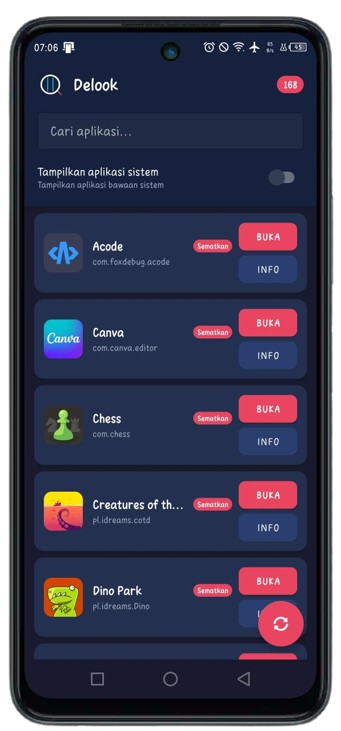

# Delook

Delook is a lightweight Android utility designed as a personal workaround tool to bypass the strict app limitations of the Ultra Marathon (Ultra Power Saving) mode on Infinix smartphones. Unlike standard app listers, Delook registers itself globally to handle any share intent, allowing the user to call a list of installed applications even when the system is heavily locked down.

---

## Screenshot

Below is the main interface of Delook displaying the list of installed applications:

  

---

## Background and Backstory

The Ultra Marathon mode on Infinix devices is highly efficient at preserving battery life during emergencies. However, it completely locks down the device, hiding the custom wallpaper and disabling access to almost all applications except for a few system defaults like SMS, Phone, and Calendar. Because there is no native way to customize or whitelist additional applications, it can be inconvenient when you need to access a specific app without completely turning off the power-saving environment.

To solve this limitation without root access or dangerous system modifications, Delook was created to exploit the standard system share menu and bridge the gap between the locked environment and your installed apps.

---

## Technical Workaround and How It Works

This application operates completely offline and achieves the bypass using the following execution logic:

1. The device enters Infinix's Ultra Marathon mode, which restricts access to the standard launcher.
2. The user opens the stock SMS app and types a raw URL link such as "www.google.com" into a text box.
3. Clicking this link forces the Android system to call the internal WebView component to render the page locally, bypassing the launcher restriction.
4. From the internal browser view, the user triggers the native "Share Page" button.
5. Because Delook is configured to handle any generic HTML share intent, it appears as an available target in the system share sheet.
6. Selecting Delook immediately launches its main activity, which queries the package manager and displays a clean list of all installed applications, allowing the user to launch them directly over the active Marathon mode background.

---

## License

This project is open-source and distributed under the terms of the GNU General Public License v3 (GPL-3.0).
